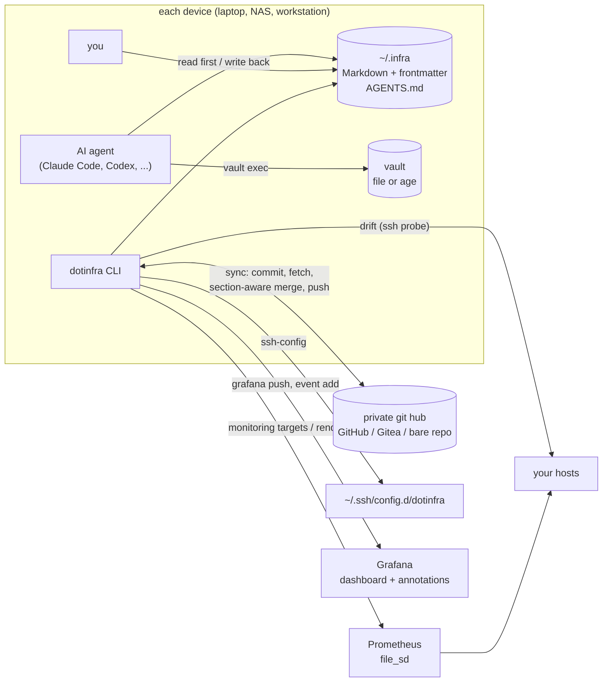

# dotinfra

[](https://github.com/PiotrTopa/dotinfra/actions/workflows/ci.yml)
[](https://github.com/PiotrTopa/dotinfra/releases)
[](LICENSE)


**A Markdown CMDB for your servers that AI agents read before they touch anything and update after every change.**
One file per host, network, domain or service in `~/.infra`; secrets in a vault, never in the docs.
Git sync with section-aware merges keeps every device's copy current, and it can generate SSH config, Prometheus targets and a Grafana dashboard.

```
~/.infra/servers/gpu1.md
---
status: active
role: Local LLM inference (Ollama)
tags: [fleet, gpu]
address: 10.10.0.21
ssh:
  user: alice
  jump: hub                      # reach it through the "hub" component
metrics: [node:9100, dcgm:9400]
secrets: [gpu1_sudo]
depends_on: [nas]
updated: 2026-09-22
---
# gpu1 — GPU workstation
## Configuration ...   ## Known issues ...   ## History
- 2026-09-10 — driver 560 → 570
```

## Why

Coding agents (Claude Code, Codex, Cursor, Gemini CLI, ...) are good at infra
work, but every session starts from zero: which box runs what, how to reach it,
what broke last month. People keep that in their heads or in scattered notes
that rot. dotinfra makes the notes the agent's working memory and makes keeping
them current part of the job:

- **Plain files first.** Markdown with a small YAML header. Useful with no tool
  installed; greppable; reviewable in any git UI.
- **Rules agents actually follow.** `AGENTS.md` (+ `CLAUDE.md` import) and
  bundled [Agent Skills](src/dotinfra/skills/) say: read the CMDB first, write reality back in
  the same turn, never write a secret.
- **Secrets stay out.** Docs reference vault *keys*; `dotinfra vault exec KEY -- CMD`
  pipes values to stdin so they never land in a transcript.
- **Every device has the whole picture.** `dotinfra sync` commits, merges and
  pushes through a private hub or directly between peers; a merge driver
  resolves concurrent edits per section and unions History logs.
- **Derived, not duplicated.** SSH config with jump hosts, Prometheus targets,
  a fleet dashboard and an inventory index are generated from the same files.
- **Zero dependencies.** Python ≥ 3.11 standard library, `git`, `ssh`; `age` optional.

## Architecture



## Five-minute quickstart

```sh
# 1. install (Python 3.11+, git)
pipx install git+https://github.com/PiotrTopa/dotinfra      # or: curl -fsSL https://raw.githubusercontent.com/PiotrTopa/dotinfra/main/install.sh | sh

# 2. create the CMDB in ~/.infra (git repo, AGENTS.md, CLAUDE.md, folders)
dotinfra init --name home

# 3. teach your agents the workflow (~/.claude/skills and/or ~/.agents/skills)
dotinfra skills install

# 4. first component
dotinfra new server nas --title "nas — storage" --address 10.10.0.10
$EDITOR ~/.infra/servers/nas.md        # set status: active, role, ssh, ...
dotinfra lint && dotinfra index

# 5. sync to a second device through a private hub repo
git -C ~/.infra remote add origin git@github.com:alice/infra.git   # PRIVATE repo
dotinfra sync
#    ...on the second device:
git clone git@github.com:alice/infra.git ~/.infra && dotinfra sync
dotinfra timer install --interval 15m   # optional: background sync on each device
```

Prefer to let an agent do it? After installing, ask it: *"Use the infra-onboard
skill to set up my infrastructure CMDB."* It interviews you, discovers hosts from
`~/.ssh/config` and the LAN neighbour table, probes them (with your consent)
and writes the files.

Want to look around first? `dotinfra --root examples/homelab ls` explores the
fictional [example CMDB](src/dotinfra/examples/homelab/).

## Feature tour

| command | what it does |
|---|---|
| `dotinfra init [PATH] [--example]` | create a CMDB (git repo, rules, templates, merge driver) |
| `dotinfra new KIND ID` | new component from a template (`server`, `network`, `domain`, `router`, `service`, `device`) |
| `dotinfra ls` / `show ID` | inventory and details, `--json` for scripts |
| `dotinfra lint` | schema, broken references, stale docs, **leaked secrets** |
| `dotinfra index` | regenerate `INDEX.md` |
| `dotinfra ssh-config` | `Host` blocks with `ProxyJump` from `ssh.jump` |
| `dotinfra vault ...` | `set`, `get`, `exec KEY -- CMD`, `import` legacy JSON, `migrate --to age` |
| `dotinfra sync` / `status` | commit, fetch, merge, push; ahead/behind/conflicts |
| `dotinfra peer add NAME URL` | direct device-to-device sync without a hub |
| `dotinfra reconcile` | finish or abort a merge the driver couldn't fully resolve |
| `dotinfra timer install` | systemd user timer (cron line printed as fallback) |
| `dotinfra drift [ID] [--update]` | SSH probe: OS, kernel, CPUs, RAM, IPs vs. the doc |
| `dotinfra skills install` | install the bundled Agent Skills |
| `dotinfra monitoring render` | Prometheus + Grafana + Pushgateway compose bundle wired to the CMDB |
| `dotinfra grafana dashboard/push` | the Fleet Overview dashboard |
| `dotinfra event add/list` | infra event log as Grafana annotations |
| `dotinfra doctor` | check the installation and the CMDB |

## Agent compatibility

| agent | how it picks up the rules |
|---|---|
| Claude Code | `CLAUDE.md` in the CMDB imports `AGENTS.md`; skills in `~/.claude/skills` (`dotinfra skills install --target claude`) |
| OpenAI Codex CLI | reads `AGENTS.md`; skills in `~/.agents/skills` (`--target agents`) |
| Cursor, Cline, Windsurf | open the CMDB folder or reference `~/.infra/AGENTS.md` from your project rules |
| Gemini CLI | add `~/.infra/AGENTS.md` as context (`contextFileName` in settings), or `@~/.infra/AGENTS.md` |
| anything else | "Before any infra work read `~/.infra/AGENTS.md`" in its system prompt |

Agents working in *other* repositories need a pointer too: add one line to your
global agent instructions, e.g. `~/.claude/CLAUDE.md` or `~/.codex/AGENTS.md`:
*"Infrastructure CMDB: `~/.infra` — follow `~/.infra/AGENTS.md` for any infra work."*
See [docs/agents.md](docs/agents.md).

## FAQ

**Is this Ansible/Terraform/NetBox?** No. Those describe or enforce desired state
at scale. dotinfra is the notebook you and your agents keep about a handful to a
few hundred machines: facts, access paths, decisions, history. It happily
documents machines managed by Ansible.

**Do I need an AI agent?** No. It is a well-structured notes folder with
linting, sync and generators. Agents just make keeping it current nearly free.

**Where do secrets go?** Into the vault: a 0600 JSON file outside the repo, or
an `age`-encrypted file that syncs with it. See [docs/vault.md](docs/vault.md)
and [docs/security.md](docs/security.md).

**Can the hub be public?** It should not be. The CMDB contains your topology,
addresses and access paths. Use a private repo or a bare repo on your own server.

**What happens when two devices edit the same file?** The merge driver merges
frontmatter per key and the body per `##` section, unions History lines, and
only leaves conflict markers inside the one section both sides changed
differently. See [docs/sync.md](docs/sync.md).

**Windows?** Untested. WSL works like Linux.

## Documentation

- [Concepts](docs/concepts.md) — components, kinds, the read-first/write-back loop
- [Schema](docs/schema.md) — frontmatter fields and body sections
- [Sync](docs/sync.md) — hub and peers, merge driver, conflicts, migrating
- [Vault](docs/vault.md) — backends, `exec`, importing, age
- [Monitoring](docs/monitoring.md) — targets, bundle, dashboard, events
- [Agents](docs/agents.md) — skills and wiring for each agent
- [Security](docs/security.md) — threat model
- [Migrating](docs/migrating.md) — from an existing notes folder
- [Design spec](docs/spec.md) — the implementation contract

MIT licensed. Contributions welcome — see [CONTRIBUTING.md](CONTRIBUTING.md).
