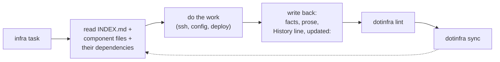

# Concepts

## The CMDB

A dotinfra CMDB is a folder (by default `~/.infra`) that is also a git
repository. It holds one Markdown file per **component** of your
infrastructure, sorted into six folders by **kind**:

| folder | kind | examples |
|---|---|---|
| `servers/` | `server` | VPS, NAS, workstation, Raspberry Pi, laptop, VM |
| `networks/` | `network` | home LAN, VLAN, WireGuard or Tailscale overlay |
| `domains/` | `domain` | `example.com` and its DNS zone |
| `routers/` | `router` | internet gateway, firewall, managed switch, access point |
| `services/` | `service` | Home Assistant, a database, a monitoring stack |
| `devices/` | `device` | UPS, printer, camera, anything with an address or a warranty |

At the root: `AGENTS.md` (rules for AI agents), `CLAUDE.md` (imports
`AGENTS.md` for Claude Code), `README.md` (for humans, starting with how to set
up a new machine), `INDEX.md` (generated inventory) and `.dotinfra.toml` (tool
configuration, shared by all devices). dotinfra's own text in README, AGENTS,
CLAUDE, `.gitignore` and `.gitattributes` sits between `dotinfra:managed`
markers, and `dotinfra migrate` refreshes it after upgrades. Anything you write
outside the markers stays as it is ([upgrading](upgrading.md)). Local-only
state lives in `.dotinfra/state/` and per-device settings in
`.dotinfra.local.toml`; git ignores both.

"CMDB" (configuration management database) sounds heavy; here it just means
*the place where the truth about your infrastructure is written down*.

## A component

```markdown
---
status: active
role: ZFS storage and backups
address: 10.10.0.10
ssh:
  user: alice
  jump: hub
metrics: [node:9100]
secrets: [nas_sudo]
depends_on: [lan, ups]
updated: 2026-09-24
---

# nas — storage and backups

## Overview
## Configuration
## Access
## Secrets
## Known issues
## History
- 2026-09-24 — scrub completed, 0 errors
```

Two layers:

- **Frontmatter** — a few machine-readable facts. Tools use them: `ssh-config`
  builds jump-host chains from `ssh.jump`, `monitoring targets` scrapes
  `metrics` at `address`, `lint` checks that `depends_on` points at real
  components. The syntax is a small YAML subset ([schema](schema.md)).
- **Body** — prose for humans and agents, in fixed H2 sections. `History` is an
  append-only, newest-first log of dated lines. The sections are also the unit
  of merging during sync.

The id is the file name (`servers/nas.md` → `nas`), unique across the CMDB.

## Read first, write back

The loop that makes the CMDB self-maintaining:



`AGENTS.md` and the bundled skills make this mandatory for agents. The result:
the next session — yours or an agent's, on this device or another — starts
from the current truth instead of from zero.

**Reality wins.** When a host contradicts its file, the file is wrong. Fix it
(or run `dotinfra drift ID --update`) and note what drifted in History. When
the file describes *intended* state (a firewall rule that should exist), agents
ask before changing the host.

## Secrets by reference

Component files name the vault keys they need (`secrets: [nas_sudo]`). Values
live in the vault — a 0600 JSON file outside the repo, or an `age`-encrypted
file that syncs with it. Agents use `dotinfra vault exec KEY -- CMD` so the
value goes straight to the command's stdin and never into a transcript.
`dotinfra lint` fails on anything that looks like a secret. See [vault](vault.md).

## Sync between devices

Every device that works on the infrastructure keeps a full clone. `dotinfra
sync` commits local edits, fetches from a **hub** (a private git repo) and/or
**peers** (other devices over SSH), merges, and pushes to the hub. A custom merge
driver resolves concurrent edits section by section, so two agents on two
machines documenting two different changes to the same server rarely conflict.
See [sync](sync.md).

## Derived artifacts

Anything that can be computed from the CMDB is generated, never maintained by hand:

| artifact | command |
|---|---|
| `INDEX.md` inventory | `dotinfra index` |
| SSH config with `ProxyJump` | `dotinfra ssh-config` |
| Prometheus targets (file_sd) | `dotinfra monitoring targets` |
| Grafana fleet dashboard | `dotinfra grafana dashboard` |
| full monitoring stack | `dotinfra monitoring render` |

## Drift

`dotinfra drift ID` runs one POSIX shell command over SSH (through the jump
host if needed) and compares hostname, kernel, OS, CPU count, memory and IPs
with the file. `--update` records them in a `facts:` block. It is the cheapest
way to check that the CMDB still describes reality.

## Lifecycle

`status` is one of `planned` → `active` ⇄ `degraded` → `retired`. Never delete
a component file: retire it, so its history and the references to it survive.
