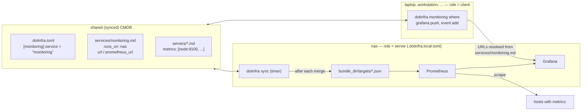

# Monitoring

dotinfra can generate everything a small Prometheus + Grafana setup needs from
the CMDB: scrape targets, a docker-compose bundle, a fleet dashboard, and an
event log. All of it is optional.

## Topology: one monitoring host, many devices

Every device syncs the whole CMDB, but the Prometheus + Grafana stack runs on
**one** machine. The CMDB records which one: `.dotinfra.toml` names a service
component, and that component's `runs_on:` is the monitoring host.



```yaml
# services/monitoring.md
id: monitoring
kind: service
status: active
runs_on: nas                                # the monitoring host
url: http://10.10.0.10:3000                 # Grafana
prometheus_url: http://10.10.0.10:9090      # optional
```

`dotinfra monitoring where` shows what every device resolves:

```text
$ dotinfra monitoring where --check
service           monitoring
host              nas
grafana           http://10.10.0.10:3000
prometheus        http://10.10.0.10:9090
this device       client (laptop)
bundle_dir        /home/alice/dotinfra-monitoring  (used on the server only)
grafana check     ok (HTTP 200)
prometheus check  ok (HTTP 200)
```

Resolution, per URL:

1. `[monitoring] grafana_url` / `prometheus_url`, if set — in `.dotinfra.toml`
   or, for one device only, in `.dotinfra.local.toml` (e.g. a laptop that
   reaches Grafana through a VPN address);
2. the service component's `url` (Grafana) / `prometheus_url` (Prometheus);
3. `http://<address>:3000` / `:9090`, where the address is the service's own
   `address`, else the `address` of its `runs_on` server;
4. `localhost`, with a warning.

`grafana push`, `event add/list/rm` and `doctor` all use this resolution.

### Setting up the monitoring host

On the machine that will run the stack (once):

```sh
dotinfra monitoring setup-server        # role = "server" in .dotinfra.local.toml, renders the bundle
cd ~/dotinfra-monitoring && cp .env.example .env    # set GRAFANA_ADMIN_PASSWORD (see below)
docker compose up -d
dotinfra timer install                  # sync every 15 min
```

If that machine already runs Grafana or Prometheus, follow
[Adopting an existing stack](#adopting-an-existing-stack) before
`docker compose up -d`.

From then on every successful `dotinfra sync` on that machine rewrites the
Prometheus targets in `<bundle_dir>/targets` (file_sd: picked up without a
restart). Any device can add a host to monitoring — edit its `metrics:` and
sync — and the server applies it on its next sync.

Every other device is a client (the default). On a client, `monitoring render`
and `monitoring targets` still work but warn that the stack runs on the host
named in the CMDB, unless you pass `--output DIR` or `--force`.

`.dotinfra.local.toml` is ignored by git; it is the place for anything that
differs per machine:

```toml
# .dotinfra.local.toml on the monitoring host
[cmdb]
device = "nas"
[monitoring]
role = "server"
bundle_dir = "/srv/dotinfra-monitoring"
```

## Targets from `metrics:`

```yaml
# servers/gpu1.md
status: active
tags: [fleet, gpu]
address: 10.10.0.21
metrics: [node:9100, dcgm:9400]
```

```sh
dotinfra monitoring targets                     # into <bundle_dir>/targets/
dotinfra monitoring targets --output /etc/prometheus/targets
dotinfra monitoring targets --stdout            # inspect
```

produces one [file_sd](https://prometheus.io/docs/prometheus/latest/configuration/configuration/#file_sd_config)
file per job — `node.json`, `dcgm.json`, ... :

```json
[
  {
    "targets": ["10.10.0.21:9100"],
    "labels": {"job": "node", "host": "gpu1", "instance": "gpu1:9100",
               "role": "fleet", "kind": "server"}
  }
]
```

- Only `status: active` and `degraded` components are included.
- The scrape address is `address` (falling back to `ssh.host`).
- `role` is `fleet` for components tagged `fleet`, otherwise `infra`. The
  dashboard shows one row per fleet host.
- `instance` is rewritten to `<id>:<port>`, so graphs show names, not IPs.
- Files for jobs that no longer exist are removed — but only files shaped like
  dotinfra's own output; hand-written `custom-*.json` files and unrelated JSON
  in the same directory are left alone.

Files are replaced atomically and Prometheus re-reads them every minute: adding,
retiring or re-addressing a host never needs a restart.

Using your own Prometheus? Point a scrape job at the directory:

```yaml
scrape_configs:
  - job_name: dotinfra        # overridden per target by the "job" label
    file_sd_configs:
      - files: [/etc/prometheus/targets/*.json]
```

## The bundle

> **Already running Grafana or Prometheus on this machine?** Read
> [Adopting an existing stack](#adopting-an-existing-stack) before the first
> `docker compose up -d`: starting the bundle's Grafana on a newer Grafana
> database can corrupt it.

```sh
dotinfra monitoring render            # into [monitoring] bundle_dir (~/dotinfra-monitoring)
cd ~/dotinfra-monitoring
cp .env.example .env
dotinfra vault exec grafana_password -- sh -c 'IFS= read -r p; printf "GRAFANA_ADMIN_PASSWORD=%s\n" "$p" >> .env'
chmod 600 .env
docker compose up -d                  # --profile node: also monitor this host; --profile gpu: DCGM
```

Contents: Prometheus (90-day retention, data in the `prometheus_data` volume
mounted at the TSDB path `/prometheus`), Grafana (datasource "dotinfra
Prometheus" provisioned with uid `dotinfra-prometheus`, dashboards loaded from
`grafana/dashboards/`), Pushgateway, and optional node_exporter and NVIDIA DCGM
exporter services.

The datasource is deliberately **not** named "Prometheus" and **not** the
default (`isDefault: false`). Grafana provisions datasources by name: on a
Grafana that already has a "Prometheus" datasource with another uid,
provisioning a second one under that name fails ("data source not found") and
Grafana restarts in a loop. And an adopted Grafana keeps whatever default
datasource it had; the fleet dashboard does not need the default because its
`datasource` variable selects uid `dotinfra-prometheus`. Make it the default
yourself in the UI or in the provisioning file (render keeps your edit) if you
want new panels to start with it.
Prometheus config and targets are **directory** mounts, so editors that save
by renaming files do not leave the container with a stale copy.

`render` never overwrites template files you have edited (it reports them as
"kept"); `--force` resets them. Targets and the dashboard are always rewritten.
Local changes that should survive even `--force` belong in
`docker-compose.override.yml` and `.env`, which the bundle never ships.
Image tags are pinned (`grafana/grafana:13.2.2`, `prom/prometheus:v3.15.0`,
`prom/pushgateway:v1.11.3`, `prom/node-exporter:v1.12.1`); override them in
`.env` (`GRAFANA_IMAGE=...`), and never point Grafana at a database written by a
newer Grafana version.
The bundle's [README](../src/dotinfra/bundle/README.md) covers installing node_exporter
on Linux, FreeBSD and macOS and setting up the DCGM exporter.

Keep targets fresh on the monitoring host by marking it as the server
(`dotinfra monitoring setup-server`) and running `dotinfra timer install`:
each sync then refreshes the targets. (Before 0.2 this needed a separate cron
line running `dotinfra monitoring targets`; that still works.)

## Adopting an existing stack

Do this **before the first `docker compose up -d`** if this machine already
runs Grafana and/or Prometheus (a hand-written compose file, `docker run`, an
older setup) and the bundle should take over their data. `dotinfra monitoring
render` and `setup-server` print a warning when docker has Grafana or
Prometheus containers or volumes that the bundle does not own, until a
`docker-compose.override.yml` exists next to the bundle's compose file.

1. **Pin Grafana to at least the version that runs now.** Grafana migrates its
   database forward on start and cannot migrate it back: an older Grafana on a
   newer database can corrupt it. The bundle's default tag may well be older
   than what a `:latest` container pulled. Ask the running container:

   ```sh
   docker exec <grafana-container> grafana server -v    # e.g. "Version 13.0.4 (...)"
   echo 'GRAFANA_IMAGE=grafana/grafana:13.0.4' >> .env    # the same version, never older
   ```

   The same version is safest: nothing is migrated, so rolling back stays
   possible. Upgrade later as a separate step. Prometheus: check
   `docker exec <prometheus-container> prometheus --version` and do not go
   below it either (`PROMETHEUS_IMAGE`).

2. **Find the old data.** List what each old container mounts:

   ```sh
   docker inspect -f '{{range .Mounts}}{{.Type}} {{.Name}} {{.Source}} -> {{.Destination}}{{println}}{{end}}' \
     <grafana-container> <prometheus-container>
   ```

   Grafana keeps its database in `/var/lib/grafana`, Prometheus its TSDB in
   the directory given by `--storage.tsdb.path` (`/prometheus` in the official
   image). A volume whose name is 64 hex characters is **anonymous**: it has
   no stable name and is lost to `docker volume prune` once its container is
   removed.

3. **Stop the old stack; do not remove it.** Stopped containers keep their
   volumes (anonymous ones included), so rolling back is one `docker start`.

   ```sh
   docker stop <grafana-container> <prometheus-container>   # or `docker compose stop` in the old project
   ```

   Optionally back up the Grafana volume now:
   `docker run --rm -v <grafana-volume>:/from:ro -v "$PWD":/backup alpine tar czf /backup/grafana-data.tgz -C /from .`

4. **Copy an anonymous Prometheus volume into a named one** (skip this when
   the TSDB already lives in a named volume). Prometheus must be stopped so the
   copy is consistent:

   ```sh
   docker volume create prometheus-history
   docker run --rm -v <64-hex-volume>:/from:ro -v prometheus-history:/to alpine cp -a /from/. /to/
   ```

   `cp -a` keeps the file owner (`nobody` in the official image).

5. **Reuse the volumes in `docker-compose.override.yml`**, next to the bundle's
   `docker-compose.yml`. Docker Compose merges it automatically and
   `dotinfra monitoring render` never touches it:

   ```yaml
   # docker-compose.override.yml: keep the data of the stack this bundle replaces.
   # `external: true` means compose uses these volumes as they are and never
   # creates or deletes them (not even with `docker compose down -v`).
   volumes:
     grafana_data:
       external: true
       name: grafana-storage          # the old Grafana volume (step 2)
     prometheus_data:
       external: true
       name: prometheus-history       # the named copy (step 4) or the old named volume

   # Data in a host directory (bind mount) instead of a volume? Mount it over
   # the same container path; compose replaces the bundle's mount:
   # services:
   #   grafana:
   #     volumes:
   #       - /srv/grafana:/var/lib/grafana
   ```

6. **Start and check.**

   ```sh
   docker compose config --volumes     # shows grafana_data and prometheus_data
   docker compose up -d
   docker compose logs grafana | grep -iE 'error|migrat'
   dotinfra monitoring where --check
   ```

   The adopted Grafana keeps its users, dashboards, datasources and admin
   password (`GRAFANA_ADMIN_PASSWORD` only applies to a new database). The
   bundle adds the datasource "dotinfra Prometheus" next to any existing
   "Prometheus" one; an old datasource that pointed at the old container's
   hostname may need its URL changed to `http://prometheus:9090`. To keep
   existing series names, give components a `labels:` map with `host:`.

7. **Roll back** if anything is wrong: `docker compose down` in the bundle
   (external volumes are kept), then `docker start` the old containers. Remove
   the old containers and volumes only after the new stack has run for a while.

## The fleet dashboard

`dotinfra grafana dashboard > fleet.json` or, with the bundle, automatically.
"Fleet Overview — <cmdb name>" (uid `dotinfra-fleet`) contains:

- a **row per fleet host** (repeated from a `host` variable): up/down, CPU,
  RAM, root disk, CPU temperature, GPU utilisation, VRAM, GPU temperature and
  power, load per core, fan speed, network throughput, uptime;
- **host comparison** time series for the same metrics;
- an **up/down timeline** of every scrape target (fleet and infra);
- **event annotations**, colour-coded by type.

The `host` variable is filled from Prometheus
(`label_values(up{role="fleet"}, host)`), so the dashboard never needs
regenerating when hosts come and go. Hosts without an NVIDIA GPU show "no GPU".
Queries cover Linux and FreeBSD node_exporter metric names, DCGM exporter
metrics and the `nvidia_smi_*` names of `nvidia_gpu_exporter`.

### Pushing to an existing Grafana

```sh
dotinfra grafana push                 # generated dashboard, folder "Fleet"
dotinfra grafana push --file my.json --folder "" --home
```

Credentials: the Grafana URL resolved as described under
[Topology](#topology-one-monitoring-host-many-devices), `grafana_user`, and the password from
the vault key named by `grafana_password_key`. To use a service-account token
instead, store it in the vault and set `grafana_token_key = "grafana_token"`.
The dashboard uses a `datasource` variable (default uid `dotinfra-prometheus`),
so it works with any Prometheus datasource you pick in the UI.

A dashboard provisioned from files (the bundle) cannot also be pushed over the
API with the same uid; use one method per Grafana.

## Event log

Infra events are Grafana annotations tagged `dotinfra`, `host:<id>` and
`type:<type>`; the dashboard overlays them on every graph.

```sh
dotinfra event add --host nas --type maintenance --time 2026-09-26T08:00Z --end 2026-09-26T08:40Z "replaced disk 3"
dotinfra event add --host gpu1 --type change "NVIDIA driver 560 -> 570"      # now
dotinfra event add --host hub --type outage --time -2h --end now "provider network outage"
echo "long text" | dotinfra event add --host pi --type observation
dotinfra event list [--host ID] [--type T] [--since -7d] [--limit N] [--json]
dotinfra event rm 123
```

| type | colour | for |
|---|---|---|
| `outage` | red | something was down |
| `incident` | orange | degraded, data at risk, security event |
| `maintenance` | blue | planned work |
| `change` | purple | config, upgrades, hardware |
| `observation` | light blue | worth remembering; nothing changed |

Times: `now`, relative (`-2h`, `30m ago`), or ISO 8601 (`2026-09-26T14:05Z`,
`2026-09-26 16:05` in local time). `--host` should be a component id; unknown
ids produce a warning.

Events complement, not replace, the component's `## History`: the History
line is the durable record in git, the annotation is its view on the graphs.
