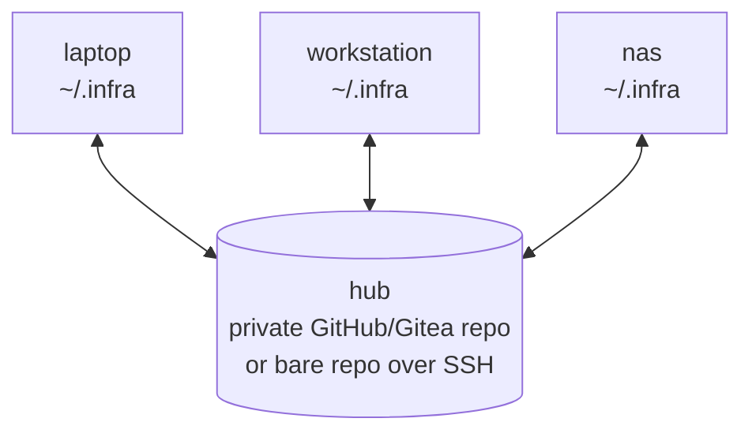
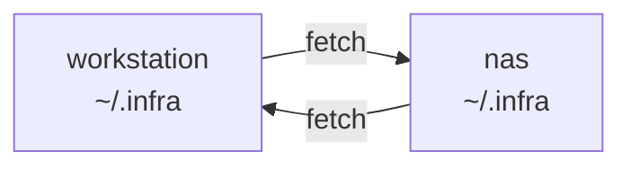

# Sync

Every device that works on your infrastructure — laptop, workstation, the NAS
that runs the monitoring stack — keeps a full clone of the CMDB. `dotinfra sync`
keeps the clones in agreement using plain git plus a merge driver that
understands component files.

## Topologies

### Hub (recommended)



Every device fetches from and pushes to one remote (`[sync] remote = "origin"`).
Works for any number of devices, including ones that are rarely online.

```sh
# first device
git -C ~/.infra remote add origin git@github.com:alice/infra.git   # a PRIVATE repo
dotinfra sync
# every other device
git clone git@github.com:alice/infra.git ~/.infra
dotinfra sync
```

A bare repo on your own server works the same:
`ssh nas 'git init --bare ~/infra.git'`, remote `ssh://nas/~/infra.git`.

### Peers (no hub)



Devices fetch directly from each other over SSH:

```sh
dotinfra peer add nas ssh://nas/~/.infra        # on the workstation
dotinfra peer add workstation ssh://workstation/~/.infra   # on the nas
dotinfra peer ls
```

Sync **pulls from peers but never pushes to them** — git refuses pushes into a
checked-out branch, and it would bypass the other side's merge driver. Each
device pulls for itself; run a timer on each. Peers suit two or three
always-on machines. You can combine both: a hub plus peers on the LAN.

## What `dotinfra sync` does

1. If the tree is dirty (and `auto_commit = true`): commit everything as
   `sync(<device>): 2 file(s): servers/nas.md, services/monitoring.md`.
2. Fetch the hub remote and every peer.
3. Check the incoming commits: if the `.dotinfra.toml` they bring asks for a
   newer dotinfra (`[cmdb] min_version`), merge nothing and exit with code **3**.
   Your commit from step 1 is kept for the next sync after `dotinfra upgrade`
   (see [upgrading](upgrading.md)).
4. Merge each fetched `<remote>/main` with `git merge` (not rebase: both
   devices' history is kept and the merge driver runs). Fast-forward when possible.
5. On conflicts the merge driver could not resolve: stop, leave the repo mid-merge,
   write `.dotinfra/state/RECONCILE.md`, exit with code **2**.
6. Regenerate `INDEX.md` if stale and commit it as `index: regenerate`. On the
   monitoring host (`[monitoring] role = "server"`), refresh the Prometheus
   targets (see [monitoring](monitoring.md#topology-one-monitoring-host-many-devices)).
7. Push `main` to the hub (skip with `--no-push`). A failed fetch or push is
   reported and gives exit code 1.

It is idempotent and takes a lock (`.dotinfra/state/sync.lock`, stale after
10 minutes), so running it from a timer and by hand at the same time is safe.
`--dry-run` shows what would happen.

## The merge driver

`.gitattributes` routes `*.md` through `dotinfra merge-driver`, registered in
each clone's git config by `dotinfra init` and `dotinfra sync`. (A plain
`git pull` in a clone where it was never registered falls back to git's line
merge — run `dotinfra sync` once on every new clone.)

It performs a three-way merge of one component file, using the common
ancestor (*base*), this device's version (*ours*) and the other device's (*theirs*):

**Frontmatter, key by key**
- changed on one side → take that side;
- changed on both sides to the same value → take it;
- both changed differently: lists → union (ours first); `updated` → the later
  date; anything else → conflict.

**Body, section by section** (split at `## ` headings)
- changed on one side → take that side; added on one side → keep it;
- deleted on one side and untouched on the other → delete;
- `History` / `Changelog` / `Log` sections → union of the bullet lines,
  de-duplicated, sorted newest first;
- other sections changed on both sides: if both sides only *added* lines (two
  devices each appending a `Known issues` bullet), both additions are kept,
  ours first; otherwise a line-level merge of just that section, and if that
  still conflicts, conflict markers appear **inside that section only**.

### Worked example

Base version of `servers/nas.md` (excerpt):

```markdown
---
status: active
tags: [storage]
updated: 2026-09-01
---
## Configuration
- NFS export tank/models
## Known issues
## History
- 2026-09-01 — created
```

On the **laptop**, an agent enables SMB:

```markdown
tags: [storage, smb]
updated: 2026-09-20
## Configuration
- NFS export tank/models
- SMB share tank/photos
## History
- 2026-09-20 — enabled SMB share for photos
- 2026-09-01 — created
```

Meanwhile on the **workstation**, another agent notes a failing disk:

```markdown
status: degraded
tags: [storage, zfs]
updated: 2026-09-22
## Known issues
- disk 3: 8 reallocated sectors
## History
- 2026-09-22 — disk 3 reallocated sectors; status degraded
- 2026-09-01 — created
```

Plain git would conflict on the frontmatter and History. The dotinfra driver produces:

```markdown
status: degraded                 # changed on one side only
tags: [storage, smb, zfs]        # both changed a list -> union
updated: 2026-09-22              # both changed -> later date
## Configuration                 # changed on one side only
- NFS export tank/models
- SMB share tank/photos
## Known issues                  # changed on one side only
- disk 3: 8 reallocated sectors
## History                       # union, newest first
- 2026-09-22 — disk 3 reallocated sectors; status degraded
- 2026-09-20 — enabled SMB share for photos
- 2026-09-01 — created
```

No conflict, no human needed.

## Recovering from conflicts

A real conflict happens when both sides change the same scalar
(`address: 10.10.0.21` vs `address: 10.10.0.22`) or the same lines of the same
section. `dotinfra sync` exits 2 and prints what to do.

1. `dotinfra status` / `cat .dotinfra/state/RECONCILE.md` — which files, which sections.
2. Edit each file; markers are confined to the conflicting section or key:

   ```
   <<<<<<< ours
   - Ollama listens on 10.10.0.21:11434
   =======
   - Ollama listens on 0.0.0.0:11434 behind nftables
   >>>>>>> theirs
   ```

   Keep what matches **reality** — check the host when unsure (`dotinfra drift ID`,
   `ssh ID ss -ltnp`). Keep both when both are true.
3. `dotinfra reconcile --continue` — verifies no markers remain, lints, commits
   the merge as `reconcile(<device>): ...` and pushes.
4. Or `dotinfra reconcile --abort` to return to the pre-merge state and deal with
   it later. Your local commits are safe either way.

Agents follow the same procedure (the `infra-sync` skill).

## Background sync

```sh
dotinfra timer install --interval 15m    # systemd --user timer
dotinfra timer remove
```

Without systemd (macOS, Alpine, Termux), the command prints an equivalent
crontab line to add yourself. A timer that hits a conflict simply keeps exiting
2 until someone reconciles; `dotinfra status` shows it.

## Migrating from rsync- or scp-mirrored copies

Many people start by copying `~/.infra` between machines. Copies drift, and
`rsync --delete` silently throws away the other side's edits. To switch:

**Copies that share git history** (one was cloned from the other, or they
were rsynced *including* `.git`):

1. On each device, commit whatever is there: `dotinfra sync --no-push`
   (with no remotes configured yet this only commits).
2. Create the hub (or peers) and add it as a remote on every device.
3. Run `dotinfra sync` on one device, then on the next. The merge driver
   reconciles the divergent edits; resolve whatever remains as above.
4. Delete the rsync cron jobs.

**Copies that do not share history** (independent `git init`, or no git at all):

1. Pick the most complete copy. Make it a CMDB (`dotinfra init` in place, or
   see [migrating](migrating.md)), `dotinfra lint`, commit, push to the hub.
2. On every other device: `mv ~/.infra ~/.infra.old`, then
   `git clone <hub> ~/.infra && dotinfra sync`.
3. `diff -ru ~/.infra.old ~/.infra` and re-apply real differences by editing
   the files (an agent with the `infra-sync` skill does this well). Sync.
4. Delete `~/.infra.old` once nothing is missing.

Do not merge unrelated histories with `git merge --allow-unrelated-histories`:
every file would conflict as "added on both sides" with no common base.
